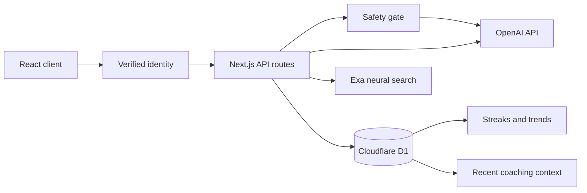

# Reframe

Reframe is a full-stack, GenAI-powered habit-change companion for people who want to reduce or stop an unwanted pattern without shame. It combines personalized OpenAI coaching, durable daily check-ins, computed progress insights, live Exa research, and explicit crisis escalation.

The application does not ship with demo progress, canned coaching, fabricated research, or silent fallbacks. If a database or external API request fails, Reframe displays an error instead of substituting fake output.

## Live application

Production: [reframe-habit-companion.posimreddy-anishkuma.chatgpt.site](https://reframe-habit-companion.posimreddy-anishkuma.chatgpt.site)

The hosted application uses production-only secret environment variables and a Cloudflare D1 database. Local `.env` files are separate from the hosted configuration.

## Core capabilities

| Capability | Real implementation |
| --- | --- |
| Personalized onboarding | OpenAI classifies the described habit and generates a new starting plan from the user’s description, severity, and goal. |
| Daily check-ins | Check-ins are written to Cloudflare D1 with urge count, slip-ups, mood, triggers, context, date, and time of day. |
| Progress dashboard | Streaks, averages, urge trends, charts, frequent triggers, and time-of-day patterns are calculated from stored check-ins. |
| Adaptive coaching | Each reply is generated live by OpenAI with the profile and at most 10 recent database check-ins. |
| Evidence search | The official Exa SDK performs neural search and returns real source URLs and Exa highlights. |
| Per-user identity | Sign in with ChatGPT is verified by the hosting layer; API routes derive an opaque owner key server-side and ignore browser-supplied ownership IDs. |
| Account controls | Authenticated users can export their profile/check-ins, delete all stored Reframe data, and sign out. |
| Responsible escalation | Deterministic risk phrases and OpenAI moderation can route the user away from AI coaching to human support. |
| Honest failure states | Missing keys, malformed model output, rate limits, and upstream failures are surfaced to the user. |

## User flow

1. The public home page introduces Reframe and links to the protected application.
2. The hosted dispatcher authenticates the visitor with Sign in with ChatGPT.
3. Every server request derives an opaque D1 owner key from the verified identity. The browser never chooses which user records are loaded.
4. A new user describes a habit, selects its frequency, and chooses whether to reduce or quit.
5. The server sanitizes the input and checks it for safety concerns.
6. If the input is safe for coaching, OpenAI returns a habit classification and personalized starting plan.
7. The profile and generated plan are saved in the authenticated user’s D1 scope.
8. Daily check-ins update the dashboard using stored values only.
9. The coach receives the current message, compact profile context, and up to 10 recent check-ins belonging to that user.
10. Strategy questions can be sent to Exa neural search for linked evidence sources.
11. Account controls allow a JSON export or permanent deletion of the current user’s Reframe records.
12. Crisis-related language bypasses ordinary coaching and displays professional support resources.

## Architecture



### Technology stack

- React 19 and Next.js 16 application routes
- vinext and Vite for Cloudflare-compatible builds
- Cloudflare Workers runtime and D1 persistence
- Drizzle schema and SQLite-compatible migrations
- Official `openai` JavaScript SDK
- Official `exa-js` SDK
- TypeScript with strict type checking
- Node’s built-in test runner

### Project structure

```text
app/
  api/
    chat/          Adaptive OpenAI coaching
    checkins/      Check-in storage and progress retrieval
    profile/       Onboarding and profile retrieval
    research/      Exa evidence search
    account/       Authenticated export and deletion
  chatgpt-auth.ts  Hosting-dispatcher identity integration
  globals.css      Responsive visual system
  layout.tsx       Metadata and social sharing configuration
  page.tsx         Application entry point
components/        Focused shell, navigation, onboarding, check-in, coaching, and progress UI
db/
  core.ts          Testable D1 storage primitives
  repository.ts    Runtime database adapter
  schema.ts        Drizzle table definitions
drizzle/            Generated D1 migration artifacts
lib/
  client-http.ts   Shared, tested browser request and error handling
  crisis.ts        Keyword and moderation safety checks
  openai-coach.ts  Coaching prompts and OpenAI requests
  progress.ts      Streak and trend calculations
  authenticated-user.ts  Server-only identity-to-owner mapping
  research.ts      Exa search and per-user cache
  validation.ts    Input and URL sanitization
tests/              Authentication, boundaries, progress, parsing, and storage tests
worker/             Cloudflare Worker entry point
```

## Prerequisites

- Node.js `22.13.0` or newer
- npm
- An OpenAI API key
- An Exa API key

Local development does not have the hosted Sign in with ChatGPT dispatcher. Set `REFRAME_DEV_USER_EMAIL` to create a development-only identity; that fallback is ignored when `NODE_ENV=production`.

## Local setup

1. Install dependencies:

   ```bash
   npm install
   ```

2. Create the local environment file:

   ```bash
   cp .env.example .env.local
   ```

3. Add the server-side credentials to `.env.local`:

   ```dotenv
   OPENAI_API_KEY=your_openai_api_key
   EXA_API_KEY=your_exa_api_key
   OPENAI_MODEL=gpt-5.6-sol
   REFRAME_DEV_USER_EMAIL=developer@local.test
   ```

4. Start the development server:

   ```bash
   npm run dev
   ```

5. Open [http://localhost:3000](http://localhost:3000).

Local D1 state is managed by the Cloudflare development runtime and survives ordinary page reloads. Delete local runtime state only when you intentionally want a clean database.

## Environment variables

| Variable | Required | Default | Purpose |
| --- | --- | --- | --- |
| `OPENAI_API_KEY` | Yes | None | Used for onboarding, coaching, and moderation. |
| `EXA_API_KEY` | Yes | None | Used for evidence-backed neural search. |
| `OPENAI_MODEL` | No | `gpt-5.6-sol` | Overrides the Chat Completions model used for plans and coaching. |
| `REFRAME_DEV_USER_EMAIL` | Local only | None | Supplies a development identity when the hosted authentication headers are unavailable. Ignored in production. |

These values must remain server-side. Never prefix them with `NEXT_PUBLIC_`, commit `.env.local`, place them in client code, or include them in `.openai/hosting.json`.

Hosted Sites environment variables are managed independently from local `.env.local`. After changing hosted variables, redeploy a saved site version so the new environment revision becomes active.

## Database model

Reframe declares the logical D1 binding as `DB` in `.openai/hosting.json`.

### `profiles`

| Column | Description |
| --- | --- |
| `session_id` | Legacy physical column name containing a server-derived opaque owner key; primary key. |
| `habit_description` | Sanitized onboarding description. |
| `severity` | `mild`, `moderate`, or `high`. |
| `goal` | `reduce` or `quit`. |
| `habit_type` | Classification returned by OpenAI. |
| `starting_plan` | Personalized plan returned by OpenAI. |
| `created_at`, `updated_at` | ISO timestamps. |

### `checkins`

| Column | Description |
| --- | --- |
| `id` | Random UUID primary key. |
| `session_id` | Legacy physical column name containing the authenticated owner key. |
| `checkin_date` | User-selected calendar date. |
| `urges` | Integer from 0 to 100. |
| `slipups` | Integer from 0 to 100. |
| `mood` | Integer from 1 to 5. |
| `triggers_json` | Sanitized trigger list serialized as JSON. |
| `context` | Optional sanitized reflection. |
| `time_of_day` | Morning, afternoon, evening, or late night. |
| `created_at` | ISO timestamp. |

Tables and the check-in lookup index are created defensively at runtime. Generated migration files are also included for hosted deployment.

## API routes

All routes accept and return JSON and require an authenticated identity. Ownership values are derived on the server and never accepted in query strings or request bodies. Sensitive keys are read only inside server code.

### `GET /api/profile`

Returns the current authenticated user’s stored profile or `null` for a new account.

### `POST /api/profile`

Validates onboarding input, runs the safety gate, calls OpenAI, and stores the resulting profile.

```json
{
  "habitDescription": "I automatically check my phone when work becomes difficult.",
  "severity": "moderate",
  "goal": "reduce"
}
```

A successful response contains the persisted profile and actual model identifier. A safety escalation response contains professional-support copy and resource links instead of an AI plan.

### `GET /api/checkins`

Returns up to 30 recent entries and progress statistics calculated from them.

### `POST /api/checkins`

Stores a validated check-in and returns the saved entry, refreshed history, and recomputed progress.

```json
{
  "checkinDate": "2026-07-18",
  "urges": 6,
  "slipups": 1,
  "mood": 3,
  "triggers": ["difficult work", "evening"],
  "context": "I was stuck on a report.",
  "timeOfDay": "evening"
}
```

### `POST /api/chat`

Runs the safety gate, loads the current profile and 10 most recent check-ins, then requests a fresh coaching response from OpenAI.

```json
{
  "message": "I want to grab my phone while working. What can I do for two minutes?"
}
```

Chat messages and AI replies are not written to the database. Only the current message and necessary recent context are sent for that request.

### `POST /api/research`

Combines the stored habit classification with a sanitized strategy question and calls Exa neural search.

```json
{
  "question": "What evidence-based strategies reduce automatic phone checking?"
}
```

The response contains only real Exa results that have valid HTTP or HTTPS URLs. Titles, published dates, source links, and available Exa highlights are displayed without invented attribution.

### `GET /api/account?download=1`

Exports the authenticated user’s account label, profile, and check-ins as a JSON attachment. The opaque owner key is never included.

### `DELETE /api/account`

Permanently deletes the authenticated user’s Reframe profile and check-ins. The UI requires the user to type `DELETE` before enabling this request.

## Authentication and data isolation

The primary authentication path is hosting-dispatcher-owned Sign in with ChatGPT. The application reads only the verified `oai-authenticated-user-*` request headers on the server. Protected page rendering redirects an unauthenticated visitor to the dispatcher’s sign-in route, and each API route independently rejects missing identity with HTTP `401`.

For storage, the server normalizes the verified email and hashes it with SHA-256 into an opaque `usr_…` owner key. D1 queries always use that derived value. Client requests no longer contain a session ID, email, owner ID, or other database selector, and API responses strip the internal owner key.

## AI behavior

The shared coaching system prompt instructs the model to:

- remain warm, practical, and non-judgmental;
- use behavior-change approaches such as implementation intentions, urge surfing, stimulus control, friction design, habit stacking, and compassionate relapse planning;
- treat setbacks as useful information;
- reference patterns only when the supplied database history supports them;
- avoid diagnosis, shame, moral claims, and claims of replacing professional care;
- route crisis, self-harm, dangerous withdrawal, or severe dependency toward human support.

Onboarding requests structured JSON with a short habit classification and a personalized plan containing concrete steps. The server rejects empty or malformed model responses.

To control latency and cost, coaching requests include only compact profile fields and at most 10 recent check-ins. Full database history and raw HTML are never sent to OpenAI.

## Evidence search and caching

Evidence search uses `exa.search()` with:

- `type: "neural"`;
- a maximum of five results;
- content highlights focused on the user’s question;
- a 72-hour maximum content age preference;
- HTTP/HTTPS URL validation.

Normalized, identical queries are cached per authenticated owner for 30 minutes in the current server instance. The cache prevents immediate duplicate calls and prevents one user’s research cache from being returned to another, but is intentionally not durable across worker instances or deployments.

## Progress calculations

All progress numbers are deterministic functions of stored check-ins:

- **Streak:** consecutive UTC calendar days ending today or yesterday. Multiple entries on one date count as one streak day.
- **Average urges:** arithmetic mean of the retrieved urge counts, rounded to one decimal place.
- **Urge trend:** requires at least four entries. The mean of the newer half is compared with the older half. A change of at least `0.75` is classified as rising or improving; smaller changes are steady.
- **Top triggers:** occurrence counts across sanitized trigger arrays, sorted by frequency.
- **Top time of day:** the most frequently logged period.
- **Chart:** the most recent 14 retrieved entries, rendered from their stored urge counts.

New profiles show explicit empty states and “not enough data” instead of sample charts.

## Safety and responsible design

Reframe is a behavior-change companion, not medical care.

Onboarding and chat input pass through two real safety layers:

1. deterministic checks for phrases related to self-harm, suicide, overdose, and dangerous withdrawal;
2. OpenAI’s `omni-moderation-latest` self-harm categories when the API key is available.

When escalation triggers, Reframe does not generate an ordinary coaching response. It displays:

- [Find A Helpline](https://findahelpline.com/) for country-specific support;
- the [988 Suicide & Crisis Lifeline](https://988lifeline.org/) for the United States;
- a reminder to contact local emergency services when there is immediate danger.

The escalation does not diagnose the user or claim that a specific condition exists.

## Security and privacy notes

- All free-text input is stripped of control characters, whitespace-normalized, length-limited, and validated before use.
- External source links are restricted to HTTP and HTTPS URLs.
- API keys never enter the browser bundle.
- `.env*` files are ignored, with only `.env.example` committed.
- Habit descriptions and check-in context are sensitive data and are stored only because they are required for the product workflow.
- OpenAI receives onboarding text, the current chat message, compact profile fields, and limited recent check-in context.
- Exa receives the stored habit classification and current research question.
- Authentication and ownership are checked server-side on every profile, check-in, coach, research, export, and deletion request.
- The browser never supplies the database owner key, and owner keys are stripped from API responses.
- Sign in with ChatGPT gives regular users cross-device continuity for the same verified identity.
- Users can export or permanently delete their Reframe data from Account & privacy.
- Reframe makes no clinical compliance claim.

## Error handling

The application does not hide service failures:

- Missing OpenAI or Exa keys produce clear configuration errors.
- Invalid or empty OpenAI responses are rejected.
- Rate limits and provider errors are converted to readable service messages.
- Invalid onboarding, authentication, check-in, or search inputs return validation errors.
- Research results with unsafe URL protocols are discarded.
- Empty Exa results display an honest no-results state.

## Accessibility

- Every page has a keyboard-visible skip link targeting a focusable main region.
- Native buttons, links, fields, radio groups, headings, landmarks, and account disclosure controls preserve keyboard behavior and semantic roles.
- Custom segmented controls expose visible focus rings, and all interactive elements receive high-contrast focus treatment.
- Active application navigation uses `aria-current`, while live coaching, loading, success, and error states use appropriate live-region or busy semantics.
- Charts include exact date-and-value text alternatives, not only visual bars.
- Links that open a new tab announce that behavior to screen readers and use `noopener noreferrer`.
- Reduced-motion preferences disable nonessential transitions and smooth scrolling.

## Testing and validation

Run the automated tests:

```bash
npm test
```

The current suite verifies:

- streak behavior across consecutive dates;
- averages, trend classification, and trigger counting;
- D1-compatible check-in storage and retrieval, including JSON trigger round-tripping.
- deterministic, case-insensitive identity hashing with no raw email in the owner key;
- per-owner database isolation and deletion that preserves other users’ records.
- centralized client JSON success, error, and malformed-response handling;
- free-text normalization, numeric bounds, and unsafe URL rejection;
- Exa-result parsing, sanitization, fallback titles, and unsafe-source removal;
- deterministic crisis escalation before ordinary coaching;
- response redaction that prevents internal owner identifiers from reaching browsers.

Run strict TypeScript checking:

```bash
npx tsc --noEmit
```

Build the production worker and client assets:

```bash
npm run build
```

Regenerate migrations after schema changes:

```bash
npm run db:generate
```

### Manual validation walkthrough

1. Open the main production URL and follow the Sign in with ChatGPT action.
2. Start with an empty authenticated account and confirm the dashboard contains no fabricated data.
3. Complete onboarding with a non-crisis sample habit and verify the returned classification and plan are personalized.
4. Log a check-in and verify the streak, average urges, chart, triggers, and time-of-day pattern use the submitted values.
5. Reload the page and verify the profile and check-in persist for the same identity.
6. Ask the coach about a logged trigger and verify the response is labeled with the actual model identifier.
7. Search for an evidence-based strategy, open returned source links, then repeat the query and verify the scoped cache is consistent.
8. Open Account & privacy, download the JSON export, and verify it contains only the current account’s profile/check-ins and no internal owner key.
9. Sign out, visit `/app` directly, and confirm protected access redirects to ChatGPT sign-in.
10. Use clearly crisis-related synthetic test language and verify Reframe shows escalation resources instead of coaching.
11. Type `DELETE` in Account & privacy, delete the data, and confirm onboarding is shown again while another account remains unaffected.
12. Temporarily remove a development API key and verify the UI displays an error rather than a canned response.

Do not use a real crisis disclosure as test data. Use an obviously synthetic phrase in an isolated development session.

## Available scripts

| Command | Purpose |
| --- | --- |
| `npm run dev` | Start the local vinext development server. |
| `npm run build` | Create the production Cloudflare-compatible build. |
| `npm run start` | Start the built application locally. |
| `npm test` | Run authentication, boundary, parsing, calculation, and storage tests. |
| `npm run lint` | Run ESLint. |
| `npm run db:generate` | Generate a new SQLite/D1 migration from the Drizzle schema. |

## Deployment

The repository is configured for OpenAI Sites with:

- a persisted Sites project ID;
- logical D1 binding `DB`;
- no R2 bucket;
- generated Drizzle migrations;
- Cloudflare Worker-compatible ESM output.

Production secrets must be created in the Sites environment as secret values. Updating `.env.local` does not update the published site. After secret or environment changes, redeploy the saved application version and confirm the deployment reports the new environment revision.

## Current boundaries

- Reframe is not a therapist, clinician, emergency service, or substitute for professional care.
- Chat history is intentionally ephemeral; only profiles and check-ins persist.
- Research credibility is not automatically guaranteed by search rank. Users should inspect source authorship, methods, date, and applicability.
- A single check-in can support an average and streak, but trend classification intentionally waits for at least four entries.
